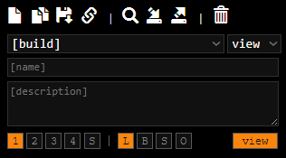
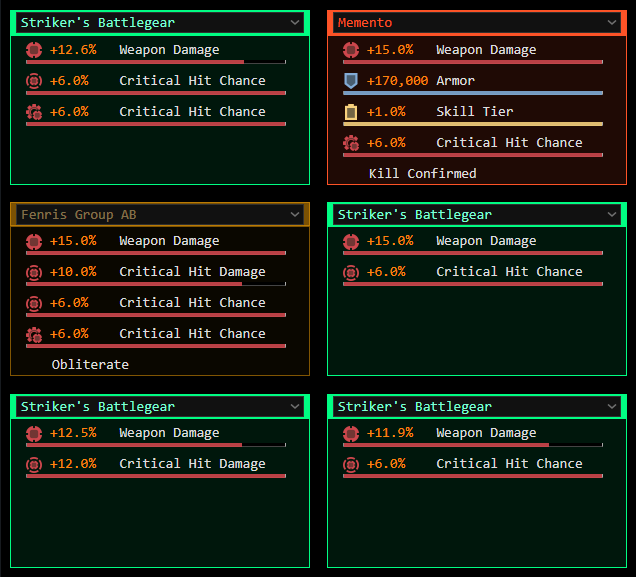
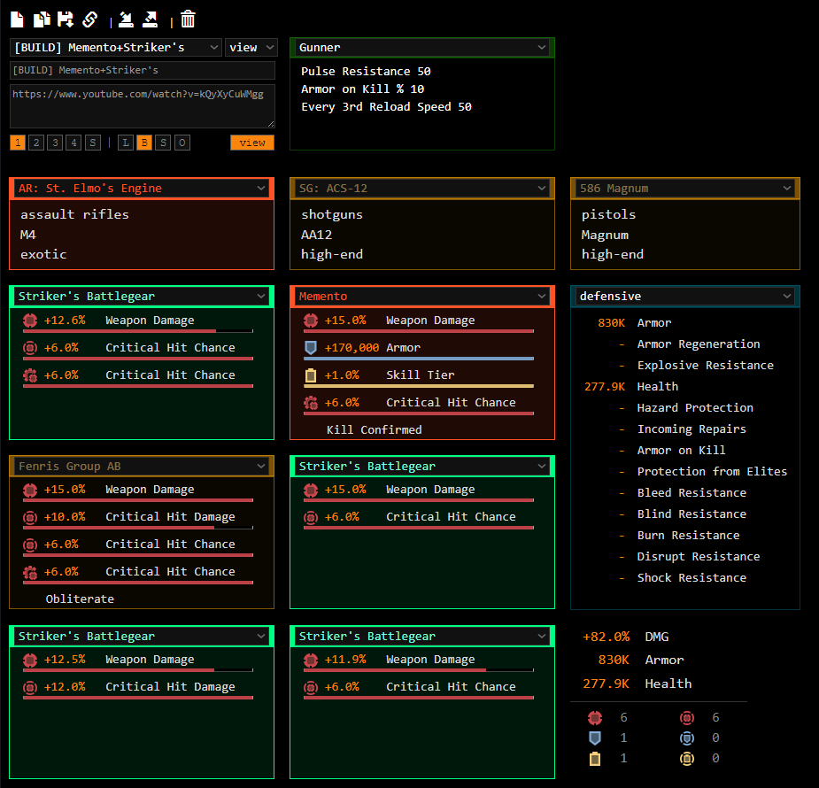

<!--
### Hi there 👋
**Division2-Loadout/Division2-Loadout** is a ✨ _special_ ✨ repository because its `README.md` (this file) appears on your GitHub profile.

Here are some ideas to get you started:

- 🔭 I’m currently working on ...
- 🌱 I’m currently learning ...
- 👯 I’m looking to collaborate on ...
- 🤔 I’m looking for help with ...
- 💬 Ask me about ...
- 📫 How to reach me: ...
- 😄 Pronouns: ...
- ⚡ Fun fact: ...
-->

# Division2-Loadout

For using **Division2-Loadout**, visit:
### https://division2-loadout.github.io/ui/

 

More functionalities and updates will be added soon. 
If you find this tool useful, feel free to make a request and we will try to work on it. 

### What is the purpose of this app?
- The main purpose is to track loadouts and builds we have set in-game.
- Allow us to have a copy of loadouts we have in-game.
- We can make as many loadouts as we want.
- Loadouts can be tagged by character: Char1/Char2/Char3/Char4/Stash.
- Loadouts can be tagged by purpose: Loadout/Build/Set/Other.
- Share loadouts with other people.
- Get a general view of the loadout stats.
- Export/Import loadouts.
- The data is stored locally on your browser.

 

### What is NOT the purpose of this app?
- This is not live data from Division 2. 
- There is no API to use, so we cannot get our in-game loadouts.
- This app is not meant for making detailed builds. You should use [mxswat/mx-division-builds](https://mxswat.github.io/mx-division-builds) for that purpose.

 

## Menu

#### **Icons**: 
- **New**: Creates new loadout.
- **Clone**: Make a copy of an existent loadout into a new name.
- **Save**: Save changes.
- **Share**: Share a short-link with the loadout.
- **Import**: Import a backup. (Import from JSON data)
- **Export**: Make a backup. (saved as a JSON file)
- **Delete**: Deletes teh selected loadout.

 

**Fields**: 
- **build/loadout**: This is the list of loadouts you saved. 
- **name**: The name of the loadout. It can be renamed by changing the name and click on save. 
- **description**: A description for the loadout. 

 

**Tags**: 
There are 2 types of tags
- **Character**: This is where the loadout/gear is stored.
- **Purpose**: Loadout/Build/Gearset/Other.

  

## Main Loadout Section

This is where we track our loadouts.  
There are 2 view modes for displaying the loadout: 
- **edit**: Allows us to make changes on the loadouts.
- **view**: shows the stats with color bars similar to in-game.

 

  

## UI Loadout

 

### **Disclaimer**: 
The weapon and specialization sections don't have any impact on the stats numbers for the moment.  

The stats block (offensive/defensive/utility/DMG/Armor/Health) is a basic represenation of the values extracted from the gear. 
For the moment, this is not considering some bonus values.

  

### **Credits and References**: 
- [GitHub mxswat](https://github.com/mxswat/mx-division-builds)
- [Division 2 Gear Spreadsheet](https://docs.google.com/spreadsheets/d/1nrPBmOrtpkEW1j5fbcRT7L-AXgsGOqMqxXoVtopsiGM/edit#gid=0)
- [The Division 2 Gear Attribute Sheet](https://docs.google.com/spreadsheets/d/e/2PACX-1vTMyKlW90Q2H3RDKXF7cISzVgs7aM9tjqFtf2ZH6i1e_U_8K_LUD2-2ccTrXrgsLBUW15U-9z7u5tgz/pubhtml#)
- [Div 2 Builder 3.0.0](https://docs.google.com/spreadsheets/d/13ktgihRoZjkcoNq7vMOOlOhE51BSfOdGuUPDPiVb9yc/edit#gid=2002839369)

 